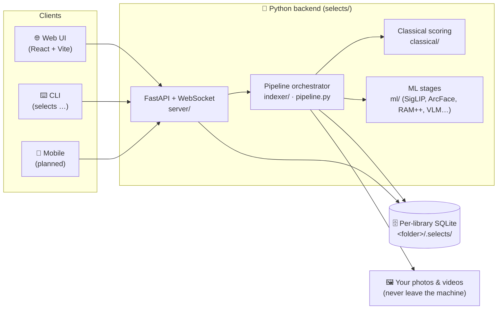

<div align="center">

# 📸 Selects

**Cull thousands of travel photos down to your keepers — locally, privately, on your own machine.**

Point it at a folder of photos and videos. It indexes, scores, clusters, and groups them into
day-by-day stories, surfaces the best shots, and gets out of your way. Nothing is uploaded anywhere.

[](https://pypi.org/project/selects/)
[](https://www.python.org/)
[](https://github.com/bihanikeshav/selects/actions/workflows/ci.yml)
[](LICENSE)
[](#-platform-support)

</div>

<!-- Add a UI screenshot or short GIF here — it's the single biggest improvement a README can get. -->

---

## ✨ Why Selects

Coming home from a trip with 3,000 photos is the problem. Selects is the AI culling assistant that
turns that pile into a shortlist — **100% on-device**, so your memories never leave your computer.
The only network call is an optional place-name lookup for geotagged shots.

- 🔒 **Private by design** — all inference runs locally. No cloud, no account, no upload.
- 🧠 **Actually smart** — semantic search, face grouping, aesthetic scoring, eyes-open burst picking.
- 🎞️ **Photos _and_ video** — sampled-frame scoring, dead-footage detection, highlight segments.
- ⌨️ **Fast to cull** — keyboard-first review, side-by-side compare, and it learns your taste.
- 🧩 **Yours to extend** — clean FastAPI backend + React UI + a scriptable CLI.

## 🎯 Features

| | |
|---|---|
| 🔎 **Discovery search** | Natural-language + tag search over on-device SigLIP embeddings |
| 🏷️ **Auto tagging** | Zero-shot + RAM++ open-vocabulary labels |
| 👤 **People** | ArcFace face embeddings clustered into named "Person" identities |
| 😊 **Face-aware culling** | Eyes-open / head-pose scoring picks the best frame in a burst |
| 🗺️ **Stories** | GPS + time clustering into day-by-day, place-by-place trips |
| ⭐ **Aesthetic curation** | AP25 + NIMA scoring with percentile "best-of" gating |
| 🧹 **Duplicate finder** | Exact + near-duplicate report with reclaimable-storage summary |
| ⌨️ **Keyboard culling** | Arrow-key review, undo, 100% zoom, synced-zoom compare view |
| 🎚️ **Taste learning** | A local model that nudges scoring toward _your_ keep/reject history |
| 📤 **Export** | Copy/zip keepers or write XMP star ratings back to Lightroom/darktable |
| 📖 **Trip recap** | A self-contained shareable HTML keepsake per trip |
| 🎬 **Video culling** | Frame sampling, quality scoring, dead-footage flags, highlights |
| 👀 **Watch folder** | Point it at your camera dump; new files index automatically |

## 🖥️ Platform support

v0.1 ships **CPU-only** builds — they run on any machine, just slower on the heavy ML stages.
GPU-accelerated builds are the next milestone (see the [roadmap](#-roadmap)).

| Platform | CPU (today) | GPU acceleration |
|---|:---:|---|
| 🪟 Windows (x64) | ✅ | 🔜 NVIDIA / CUDA |
| 🍎 macOS (Apple Silicon) | ✅ | 🔜 Metal (MPS) + CoreML |
| 🍎 macOS (Intel) | ✅ | — |
| 🐧 Linux (x64) | ✅ | 🔜 NVIDIA / CUDA |
| 🔴 AMD / Intel GPUs | ✅ (as CPU) | 🔮 later — ONNX Runtime DirectML / ROCm |

The pipeline **already detects your hardware** (`selects doctor`) and falls back to CPU
automatically, so the accelerated builds are a packaging change, not a rewrite.

## 📦 Install

**Desktop app (recommended).** Download the bundle for your OS from the
[latest release](https://github.com/bihanikeshav/selects/releases) and run it — no Python
required. The app downloads its AI models on first launch, with progress.

**Via pip** (needs Python 3.11+):

```bash
pip install selects          # app + web GUI + CLI
pip install "selects[ml]"    # add the on-device AI (torch, insightface, …)
selects serve                # open the web UI
selects index /path/to/trip  # or run headless from the CLI
```

RAM++ tagging installs separately (it has no PyPI release):

```bash
pip install git+https://github.com/xinyu1205/recognize-anything.git
```

> 🚀 **GPU acceleration is coming soon.** Today's builds run on **CPU** — universal, just slower.
> Accelerated builds land Apple Silicon + NVIDIA first, AMD to follow.

## 🏗️ Architecture

Selects is **API-first**: a FastAPI backend does all the work, and every client — the web UI, the
CLI, and future mobile apps — is just another consumer of the same `/api` surface. State lives in a
per-library SQLite database inside the photo folder itself (`<folder>/.selects/`), so a library is
fully self-contained and portable.



**Data flow:** files are walked and hashed → classical signals (blur/exposure/faces) → ML embeddings
and tags → face/location/theme clustering → burst "moments" → day/place "stories" and aesthetic
curation. Each stage is independently re-runnable and writes back to the same SQLite DB.

### How the pipeline works

Each stage reads/writes a per-folder SQLite database at `<folder>/.selects/index.db` and can be
re-run independently via `selects index <folder> --pass <stage>`:

1. **index** — walk the folder, hash files, decode previews/thumbnails, read EXIF/GPS
2. **classical** — blur, exposure, clipped-highlight, and face-count scoring; auto-reject gate
3. **embed** — SigLIP-SO400M image embeddings + CLIP-IQA aesthetic score
4. **tag** — zero-shot tagging via SigLIP text-prompt similarity
5. **ram_tag** — RAM++ open-vocabulary tagging (more descriptive than zero-shot)
6. **smart_tag** — HDBSCAN clustering over embeddings + VLM-generated cluster names
7. **thematic / date** — rule-driven location and day clustering from GPS/time
8. **face_embed** — ArcFace face embeddings for detected faces
9. **moment** — collapse near-duplicate/burst photos into a single representative pick
10. **story** — build day/place "stories" combining moments, tags, and locations

Aesthetic curation combines AP25 and NIMA scores with configurable per-scope and library-wide
percentile thresholds (`ap_weight`, `nima_weight`, `aesthetic_per_scope_pct`, `aesthetic_library_pct`).

## 🗺️ Roadmap

Ordered roughly by priority. Contributions on any of these are very welcome — see
[Contributing](#-contributing).

**⚡ GPU acceleration** _(next up)_
- Apple Silicon (Metal/MPS for torch, CoreML for ONNX) and NVIDIA (CUDA) builds — the priority
- One-click "enable GPU" that installs the matching torch / `onnxruntime-gpu` into the desktop bundle
- AMD & Intel GPUs via ONNX Runtime **DirectML** (Windows) / ROCm — no CUDA pinning required

**📱 Android apps** _(two distinct products)_
- **Remote / companion** — phone and laptop on the same network; the phone becomes a couch-culling
  remote that drives the desktop backend over LAN. Cheap to build because the backend is already an
  HTTP API — the app is just another client.
- **Standalone / on-device** — a free, lightweight app that culls small libraries (a few hundred
  shots) entirely on the phone using slimmed mobile models (CoreML/TFLite). No desktop needed.

**🔧 Core**
- Cursor-based pagination for large libraries
- Auto-tuning of aesthetic/burst thresholds per shooting style
- iOS parity for the mobile apps

## 🚀 Quickstart (from source)

Requires Python 3.11+ and Node 18+.

```bash
# Backend
pip install -e ".[ml]"        # add the ML stack (torch, transformers, insightface, etc.)
selects serve /path/to/photos

# Frontend (separate terminal)
cd frontend
npm install
npm run dev
```

`selects serve` starts the FastAPI backend, opens the web UI (pass `--no-browser` to skip), and
(unless `--no-background`) kicks off indexing in the background. The frontend dev server
(`npm run dev`) proxies to the backend for a hot-reloading UI.

For a single-process run, build the frontend once (`cd frontend && npm run build`) and the backend
serves the compiled UI at the same origin — no separate `npm run dev` needed. You can also run
`selects serve` with **no folder argument**: it opens the active library from your registry, or
starts on the onboarding page so you can add your first library from the browser.

Classical-only (no ML extra) works too — indexing, previews, and blur/exposure/face auto-reject:
`pip install -e .`.

Drive the pipeline directly from the CLI:

```bash
selects index /path/to/photos                # run all default stages
selects index /path/to/photos --pass embed   # run a single named stage
selects doctor                               # report CUDA/GPU capabilities
```

## ⚙️ Configuration

Configuration is per-folder, via `pydantic-settings`. Every field can be overridden with a
`SELECTS_`-prefixed environment variable (or a `.env` file), e.g. `SELECTS_WEB_PORT=9000`. Fields
(see `selects/config.py`):

| Field | Default | Notes |
|---|---|---|
| `web_port` | `8765` | Port for the web UI/API |
| `web_host` | `127.0.0.1` | Bind host |
| `burst_window_seconds` | `3` | Time window used to group burst shots |
| `burst_similarity_threshold` | `0.92` | Similarity cutoff for burst grouping |
| `ap_weight` | `0.6` | Weight of AP25 in the combined aesthetic score |
| `nima_weight` | `0.4` | Weight of NIMA in the combined aesthetic score |
| `aesthetic_per_scope_pct` | `75.0` | Photo must be in the top `(100 - pct)`% within its scope |
| `aesthetic_library_pct` | `50.0` | Photo must also be in the top `(100 - pct)`% library-wide |
| `speed_mode` | `full` | `fast` skips some ML stages for a quick preview pass |

Derived, non-configurable paths under `<folder>/.selects/`: `index.db`, `thumbs/`, `previews/`.

### Per-trip customization

The location and tagging stages ship with travel-generic defaults, tunable per library by dropping
optional JSON files into `<folder>/.selects/`:

| File | Purpose |
|---|---|
| `landmarks.json` | Named GPS landmarks (`{"name", "lat", "lon", "radius_m"}`) — a fast-path override for reverse geocoding. |
| `keywords.json` | Theme buckets (`{label: [keyword, ...]}`) for pattern/thematic stories. |
| `tag_prompts.json` | Zero-shot SigLIP tag taxonomy (`{tag: [prompt, ...]}`). |

Each file is optional; a missing or malformed one falls back to the built-in defaults. See
[`examples/ladakh/`](examples/ladakh/) for a complete worked example.

## 🧪 Development

```bash
pip install -e ".[dev]"
pytest
ruff check .
```

Database schema is managed with Alembic. Migrations ship inside the package at
`selects/db/migrations/` (there is no `alembic.ini`), and `init_db()` brings each library's SQLite
DB up to head automatically on open. After changing `selects/db/models.py`, create a revision with
autogenerate by building an in-code `Config` pointing `script_location` at `selects/db/migrations`
and `sqlalchemy.url` at a throwaway SQLite file, then calling `alembic.command.revision(cfg,
autogenerate=True, message="...")`. Always review the generated script — SQLite ALTERs must go
through `render_as_batch` (already enabled in `env.py`).

### Project layout

```
selects/               Python package: CLI, config, pipeline, DB models
├── classical/         Non-ML signal scoring (blur, exposure, faces, auto-reject)
├── decode/            Image / video / RAW decoding
├── indexer/           Folder walking, EXIF, preview generation, orchestration
├── ml/                Embedding, tagging, faces, clustering, stories, enhancement
└── server/            FastAPI app, routes, WebSocket progress bus
frontend/              React + Vite + TypeScript web UI
tests/                 pytest suite
scripts/               Standalone analysis / benchmarking (not part of the package)
docs/  ·  design/      Design notes, specs, and visual references
```

## 🧰 Packaging a desktop build

Produce a self-contained bundle (no Python on the target machine) with PyInstaller:

```bash
pip install "pyinstaller>=6.6"
python packaging/build.py            # base app
python packaging/build.py --ml       # include the ML stack
```

The script builds the frontend, copies `frontend/dist` into `selects/server/static/` so the packaged
app serves the UI same-origin, then runs PyInstaller (**onedir**) via `packaging/selects.spec`. The
result lands in `dist/selects/`. For a much smaller ML bundle, install CPU torch first:

```bash
pip install torch --index-url https://download.pytorch.org/whl/cpu
python packaging/build.py --ml
```

## 🤝 Contributing

Contributions are welcome — whether it's a GPU backend, the Android companion, better threshold
defaults, or docs.

1. Fork and create a branch.
2. `pip install -e ".[dev]"`, make your change, and add tests under `tests/`.
3. Run `pytest` and `ruff check .` — both must be green.
4. Open a PR describing the change. The [architecture](#-architecture) section and
   [roadmap](#-roadmap) are the best places to find direction.

**Good first areas:** platform-specific GPU execution providers, mobile client (the API already
exists), export formats, and tuning aesthetic/burst defaults against different shooting styles.

## ⚠️ Known limitations

- Aesthetic and burst-detection thresholds were tuned against a single trip's photos and may need
  adjustment for very different shooting styles or gear.
- List endpoints use simple offset/limit pagination, not cursor-based.
- RAM++ tagging depends on a model with no PyPI release (installed via git URL) — expect a slower,
  less reproducible install than the rest of the `ml` extra.

## 📄 License

MIT — see [LICENSE](LICENSE).
