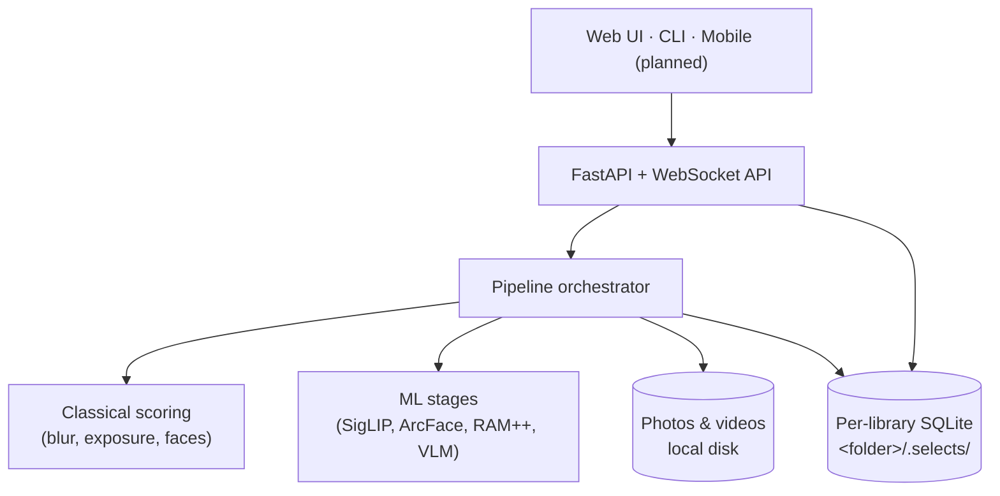

<div align="center">


# Selects

**Cull thousands of travel photos down to your keepers — locally, privately, on your own machine.**

Point it at a folder of photos and videos. It indexes, scores, clusters, and groups them into
day-by-day stories, surfaces the best shots, and gets out of your way. Nothing is uploaded anywhere.

[](https://pypi.org/project/selects/)
[](https://www.python.org/)
[](https://github.com/bihanikeshav/selects/actions/workflows/ci.yml)
[](LICENSE)

</div>

---

## Why Selects

I built Selects for the post-trip mess: 3,000 photos, five versions of the same mountain, ten blurry food shots, and one frame where everyone actually has their eyes open.

The app is meant to do the boring first pass locally, then leave the final taste call to you.

| | |
|---|---|
| **Private by design** | All inference runs locally. No cloud, no account, no upload. |
| **More than EXIF sorting** | Semantic search, face grouping, aesthetic scoring, eyes-open burst picking. |
| **Photos and video** | Frame scoring, dead-footage detection, highlight segments. |
| **Fast to cull** | Keyboard-first review, side-by-side compare, learns your taste. |
| **Yours to extend** | Clean FastAPI backend + React UI + a scriptable CLI. |

The only network call is an optional place-name lookup for geotagged shots.

## Features

| Feature | What it does |
|---|---|
| Discovery search | Natural-language + tag search over on-device SigLIP embeddings |
| Auto tagging | Zero-shot + RAM++ open-vocabulary labels |
| People | ArcFace embeddings clustered into named "Person" identities |
| Face-aware culling | Eyes-open / head-pose scoring picks the best frame in a burst |
| Stories | GPS + time clustering into day-by-day, place-by-place trips |
| Aesthetic curation | AP25 + NIMA scoring with percentile "best-of" gating |
| Duplicate finder | Exact + near-duplicate report with reclaimable-storage summary |
| Keyboard culling | Arrow-key review, undo, 100% zoom, synced-zoom compare |
| Taste learning | A local model that nudges scoring toward your keep/reject history |
| Export | Copy/zip keepers or write XMP star ratings to Lightroom/darktable |
| Trip recap | A self-contained shareable HTML keepsake per trip |
| Video culling | Frame sampling, quality scoring, dead-footage flags, highlights |
| Watch folder | Point it at your camera dump; new files index automatically |

## Install

**Desktop app (recommended)** — download the bundle for your OS from
[Releases](https://github.com/bihanikeshav/selects/releases) and run it. No Python required; it
downloads its AI models on first launch.

**Via pip** (Python 3.11+):

```bash
pip install selects          # app + web GUI + CLI
pip install "selects[ml]"    # add the on-device AI (torch, insightface, …)
selects serve                # open the web UI
selects index /path/to/trip  # or run headless from the CLI
```

RAM++ tagging installs separately (no PyPI release):
`pip install git+https://github.com/xinyu1205/recognize-anything.git`

### Platform support

Builds are **CPU-only** today — universal, just slower on the ML stages. `selects doctor` reports
detected hardware; GPU acceleration is on the [roadmap](#roadmap).

| Platform | CPU today | GPU (planned) |
|---|:---:|---|
| Windows (x64) | ✓ | NVIDIA / CUDA |
| macOS (Apple Silicon) | ✓ | Metal (MPS) + CoreML |
| macOS (Intel) | ✓ | — |
| Linux (x64) | ✓ | NVIDIA / CUDA |
| AMD / Intel GPUs | ✓ (as CPU) | ONNX Runtime DirectML / ROCm |

## Architecture

**API-first**: a FastAPI backend does all the work; every client — web UI, CLI, future mobile — is
just another consumer of the same `/api` surface. State lives in a per-library SQLite DB inside the
photo folder (`<folder>/.selects/`), so a library is self-contained and portable.



Each stage reads/writes `<folder>/.selects/index.db` and is independently re-runnable via
`selects index <folder> --pass <stage>`:

| # | Stage | Does |
|---|---|---|
| 1 | `index` | walk & hash files, decode previews/thumbnails, read EXIF/GPS |
| 2 | `classical` | blur / exposure / clipped-highlight / face scoring; auto-reject gate |
| 3 | `embed` | SigLIP-SO400M image embeddings + CLIP-IQA aesthetic score |
| 4 | `tag` | zero-shot tagging via SigLIP text-prompt similarity |
| 5 | `ram_tag` | RAM++ open-vocabulary tagging |
| 6 | `smart_tag` | HDBSCAN clustering over embeddings + VLM cluster names |
| 7 | `thematic` / `date` | rule-driven location and day clustering from GPS/time |
| 8 | `face_embed` | ArcFace embeddings for detected faces |
| 9 | `moment` | collapse near-duplicate/burst photos into one best pick |
| 10 | `story` | build day/place stories from moments, tags, and locations |

Aesthetic curation combines AP25 + NIMA with configurable per-scope and library-wide percentile
thresholds (see [Configuration](#configuration)).

## Roadmap

**Shipped (v0.1)**
- [x] Discovery search, tagging, people, face-aware culling
- [x] Stories, aesthetic curation, duplicate finder
- [x] Keyboard culling + compare, taste learning
- [x] Export (copy/zip + XMP), trip recap, video culling, watch folder
- [x] CPU desktop builds for Windows, macOS, Linux + PyPI package

**Planned**
- [ ] **GPU acceleration** — Apple Silicon (MPS/CoreML) & NVIDIA (CUDA) first, AMD (DirectML/ROCm) later
- [ ] **Android companion** — LAN remote that drives the desktop backend from your phone
- [ ] **Android standalone** — on-device culling for small libraries (no desktop needed)
- [ ] Cursor-based pagination, auto-tuned aesthetic/burst thresholds, iOS parity

## Quickstart (from source)

Requires Python 3.11+ and Node 18+.

```bash
pip install -e ".[ml]"        # ML stack (torch, transformers, insightface, …); omit [ml] for classical-only
selects serve /path/to/photos # backend + web UI (indexes in the background)

cd frontend && npm install && npm run dev   # hot-reloading UI (separate terminal)
```

`selects serve` opens the web UI (`--no-browser` to skip) and indexes in the background
(`--no-background` to skip). With the frontend built once (`npm run build`), the backend serves the
UI same-origin — no `npm run dev` needed. With **no folder argument** it opens the active library, or
onboarding if none exists. Drive stages directly with `selects index <folder> [--pass <stage>]` and
check hardware with `selects doctor`.

## Configuration

Per-folder via `pydantic-settings`; override any field with a `SELECTS_`-prefixed env var (or `.env`),
e.g. `SELECTS_WEB_PORT=9000`. See `selects/config.py`.

| Field | Default | Notes |
|---|---|---|
| `web_port` | `8765` | Web UI/API port |
| `web_host` | `127.0.0.1` | Bind host |
| `burst_window_seconds` | `3` | Time window for grouping burst shots |
| `burst_similarity_threshold` | `0.92` | Similarity cutoff for burst grouping |
| `ap_weight` / `nima_weight` | `0.6` / `0.4` | Weights in the combined aesthetic score |
| `aesthetic_per_scope_pct` | `75.0` | Must be top `(100 - pct)`% within its scope |
| `aesthetic_library_pct` | `50.0` | Must also be top `(100 - pct)`% library-wide |
| `speed_mode` | `full` | `fast` skips some ML stages for a quick pass |

Derived paths under `<folder>/.selects/`: `index.db`, `thumbs/`, `previews/`.

**Per-trip customization** — drop optional JSON into `<folder>/.selects/` (missing/malformed falls
back to defaults); see [`examples/ladakh/`](examples/ladakh/):

| File | Purpose |
|---|---|
| `landmarks.json` | Named GPS landmarks — fast-path override for reverse geocoding |
| `keywords.json` | Theme buckets for pattern/thematic stories |
| `tag_prompts.json` | Zero-shot SigLIP tag taxonomy |

## Development

```bash
pip install -e ".[dev]" && pytest && ruff check .
```

Schema is managed with Alembic; migrations ship in `selects/db/migrations/` (no `alembic.ini`) and
`init_db()` upgrades each library's DB to head on open. After editing `selects/db/models.py`,
autogenerate a revision against a throwaway SQLite URL and review it — SQLite ALTERs go through
`render_as_batch` (enabled in `env.py`).

**Layout**

| Path | Contents |
|---|---|
| `selects/` | Package: CLI, config, pipeline, DB models |
| `selects/classical/` | Non-ML scoring (blur, exposure, faces, auto-reject) |
| `selects/decode/` | Image / video / RAW decoding |
| `selects/indexer/` | Folder walking, EXIF, previews, orchestration |
| `selects/ml/` | Embedding, tagging, faces, clustering, stories, enhancement |
| `selects/server/` | FastAPI app, routes, WebSocket progress bus |
| `frontend/` | React + Vite + TypeScript web UI |
| `tests/` · `scripts/` · `docs/` | Test suite · analysis scripts · design notes |

**Desktop build** — `pip install "pyinstaller>=6.6"` then `python packaging/build.py [--ml]`. It
builds the frontend into `selects/server/static/` (same-origin UI) and runs PyInstaller (onedir) via
`packaging/selects.spec` into `dist/selects/`. For a smaller ML bundle, install CPU torch first:
`pip install torch --index-url https://download.pytorch.org/whl/cpu`.

## Contributing

1. Fork, branch, `pip install -e ".[dev]"`, add tests under `tests/`.
2. `pytest` and `ruff check .` must be green.
3. Open a PR — the [architecture](#architecture) and [roadmap](#roadmap) are the best places to find direction.

**Good first areas:** GPU execution providers, the mobile client (the API already exists), export
formats, and tuning aesthetic/burst defaults for different shooting styles.

## Known limitations

- [ ] Aesthetic/burst thresholds were tuned on a single trip; may need adjustment for other styles/gear.
- [ ] List endpoints use offset/limit, not cursor-based, pagination.
- [ ] RAM++ tagging depends on a git-only model — slower, less reproducible install than the rest of `[ml]`.

## License

MIT — see [LICENSE](LICENSE).
